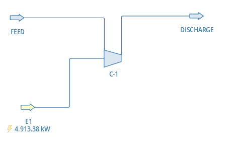

# Centrifugal Gas Compressor — 20-Year VFD Techno-Economic Analysis

> **Python extends what a process simulator cannot do alone.**  
> 20-year techno-economic analysis of VFD vs fixed-speed centrifugal compressor using Python, open-source performance curves, and DWSIM validation



---

## Overview

This notebook documents a Python-based techno-economic analysis of a **Variable Frequency Drive (VFD) investment** on a single-stage centrifugal LP gas compressor (~4 bar suction), evaluated over a 20-year field life.

The workflow is built entirely on open-source tools and real industrial performance data. It is intended as a reproducible reference for process engineers and data scientists working on similar problems.

**Core question:** Does a VFD pay back over the asset's life, and under what conditions?

---

## What the model tracks

Four compounding effects are coupled simultaneously across the 20-year horizon:

| Effect | Description |
|---|---|
| **Production profile** | Plateau → decline → plateau → decline. VFD savings are back-loaded |
| **Efficiency degradation** | Exponential decay within each overhaul interval, partial recovery at overhaul |
| **Gas composition evolution** | MW drift coupled to cumulative production, not calendar time |
| **Dual-constraint VFD control** | `N_vfd = max(N_antisurge, N_pressure)` — both surge and discharge pressure govern speed |

---

## Notebook structure

| Section | Content |
|---|---|
| 0 | User inputs — all configurable parameters in one cell |
| 1 | Imports and performance curve loading from Petrobras/ccp (GitHub) |
| 2 | Performance map — 5 speed lines, spline interpolation, fan law |
| 3 | Thermodynamic model — Lapina simplified and rigorous PR-EOS |
| 4 | Anti-surge and dual-constraint VFD control logic |
| 5 | Production profile, composition evolution, efficiency degradation |
| 6 | Lapina vs rigorous EOS comparison — 20-year divergence analysis |
| 7 | 20-year economic analysis — NPV, IRR, payback, sensitivity |
| 8 | Financial dashboard — 4-panel matplotlib |
| 9 | DWSIM validation via pythonnet — 5-point comparison across speed lines |

---

## Key findings

- **Python-based thermodynamic model validated against DWSIM**: power within 2.4% and discharge temperature within 3°C across all five speed lines. The residual difference traces to independent Cp correlations, not EOS parameters — density agreement is 0.04%. The open-source PR-EOS implementation is sufficient for this gas system.
- **Programmatic approach removes the need for simplified corrections**: the Lapina (1982) method holds suction density fixed at design conditions — adequate for a single operating point, but it accumulates a 5.6% power underestimation by year 20 as the gas gets heavier. Running rigorous EOS at every timestep costs nothing extra in a loop.
- **Realistic asset lifecycle model**: production profile, efficiency degradation with overhaul recovery, and gas composition evolution coupled to cumulative production are all tracked simultaneously — giving an operating picture that a single design-point simulation cannot provide.
- **Multiple KPIs for robust investment decisions**: NPV, IRR, simple payback, and discounted payback are reported together because they tell different parts of the story. Simple payback is insensitive to the compression ratio constraint; NPV and IRR are not — and that difference matters for capital allocation.

---

## Performance data

Real compressor curves from the **Petrobras/ccp** open-source dataset (Apache 2.0):

- 5 speed lines: 6,882 — 7,865 — 8,848 — 9,831 — 10,322 RPM  
- Suction: P = 4.08 bar, T = 33.6 °C  
- Gas: ~59% CH₄, ~37% CO₂  
- Loaded directly from GitHub — no local data files required

```python
BASE_URL = "https://raw.githubusercontent.com/petrobras/ccp/main/ccp/tests/data/"
```

---

## Requirements

```
python >= 3.10
numpy
pandas
matplotlib
scipy
thermo          # Caleb Bell — PR-EOS thermodynamics
pythonnet       # Section 9 (DWSIM validation) only
```

DWSIM 9.x is required only for Section 9. All other sections run without it.

---

## Repository structure

```
dwsim-compressor-vfd-analysis/
├── README.md
├── Gas_Compressor_VFD_Analysis.ipynb
├── images/
│   └── Snapshot_Compressor_DWSIM.png
├── dwsim/
│   └── Compressor_Validation.dwxmz
└── LICENSE
```

---

## References

1. **Petrobras/ccp** (Apache 2.0) — real compressor performance curves  
   https://github.com/petrobras/ccp

2. **Lapina, R.P. (1982)** — simplified correction for inlet condition deviations  
   *How to Use the Performance Curves to Evaluate Behavior of Centrifugal Compressors*  
   https://files.engineering.com/files/994bf492-fd6d-46b7-b980-29865230fcf6/How_to_Use_the_Perf_Curves_to_Evaluate_Behavior_of_Cent_Comp.pdf

3. **Kurz, R., Mistry, J., Davis, P., & Cole, G.J. (2020)** — VFD control and operating constraints  
   *Application and Control of Variable Speed Centrifugal Compressors in the Oil and Gas Industry*  
   https://www.researchgate.net/publication/363089188

4. **Campbell Tip of the Month, Nov 2011** — rigorous vs shortcut compressor calculations  
   http://www.jmcampbell.com/tip-of-the-month/2011/11/compressor-calculations-rigorous-using-equation-of-state-vs-shortcut-method/

5. **Campbell Tip of the Month, Nov 2008** — effect of MW on centrifugal compressor performance  
   http://www.jmcampbell.com/tip-of-the-month/2008/11/effect-of-gas-molecular-weight-on-centrifugal-compressor-performance/

6. **thermo** (MIT) — Python thermodynamics library  
   https://github.com/CalebBell/thermo

---

## License

MIT — see [LICENSE](LICENSE)
